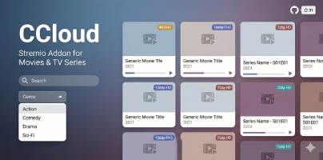

# CCloud Addon برای Stremio

[English](README.en.md)

<p align="center">
  
</p>

افزونه CCloud برای اپلیکیشن Stremio که امکان تماشای فیلم و سریال را فراهم می‌کند.

## ویژگی‌ها

- مشاهده لیست فیلم‌ها و سریال‌ها
- جستجوی فیلم و سریال
- فیلتر بر اساس ژانر
- نمایش اطلاعات کامل شامل کارگردان، بازیگران و خلاصه داستان
- پخش با کیفیت‌های مختلف (4K, 1080p, 720p, ...)

## نصب

### نصب خودکار (پیشنهادی)

1. لینک زیر را در مرورگر باز کنید:
   ```
   https://ccloud-addon.onrender.com/
   ```
2. روی دکمه **Install** کلیک کنید
3. اپلیکیشن Stremio باز می‌شود و افزونه نصب می‌شود

### نصب دستی

اگر نصب خودکار کار نکرد:

1. لینک زیر را کپی کنید:
   ```
   stremio://ccloud-addon.onrender.com/manifest.json
   ```

2. اپلیکیشن Stremio را باز کنید

3. به بخش **Addons** بروید

4. روی **Add addon** کلیک کنید

5. لینک را paste کنید و دکمه **Add** را بزنید

## استفاده

بعد از نصب، دو بخش جدید در صفحه اصلی Stremio اضافه می‌شود:

- **CCloud Movies** - لیست فیلم‌ها
- **CCloud Series** - لیست سریال‌ها

می‌توانید از فیلتر ژانر برای پیدا کردن فیلم یا سریال مورد نظر استفاده کنید.

## منبع

بر اساس پروژه [CCloud](https://github.com/code3-dev/CCloud)

## توسعه‌دهنده

ساخته شده با Node.js و [Stremio Addon SDK](https://github.com/Stremio/stremio-addon-sdk)

---


## Stargazers over time
[](https://starchart.cc/masooddalman/CCloud-stremio-addon)